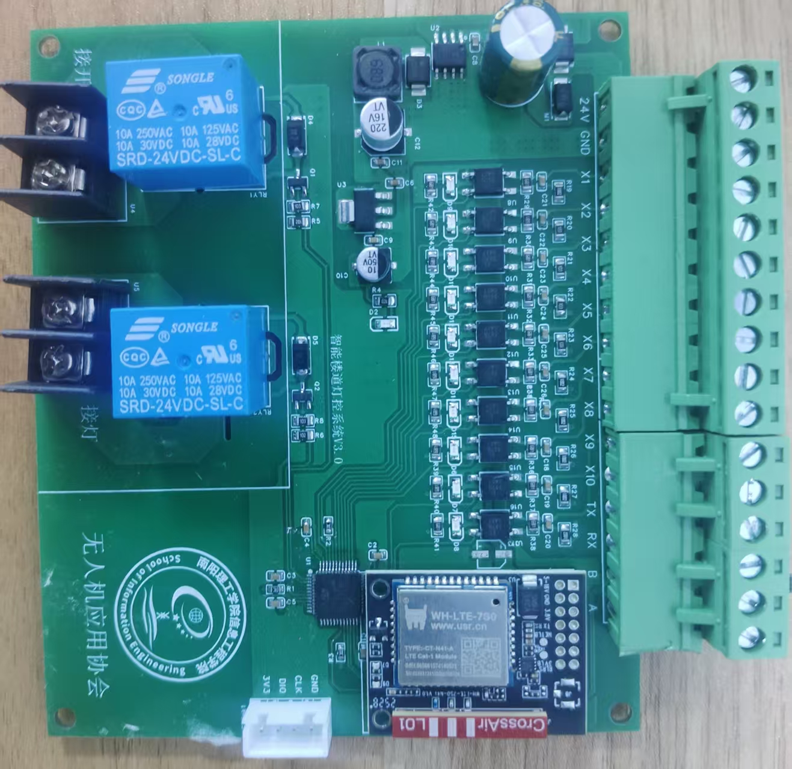
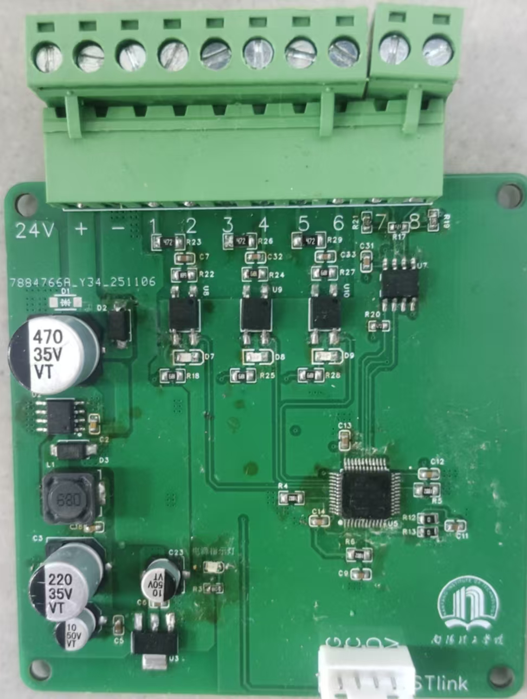

# 智能灯控系统(RS485 多从机)

> 基于 STM32F1 + RS485 半双工总线的分布式灯具控制系统  
> 工程包含两个从机固件:**传感器从机** 与 **开关从机**,由上位机/主机通过自定义协议轮询控制

---

## 一、系统架构

```
                    ┌──────────────┐
                    │   主控/上位机  │  
                    └──────┬───────┘
                           │  RS485 半双工总线 (A/B 差分)
            ┌──────────────┼──────────────┐
            ▼                              ▼
   ┌────────────────┐            ┌────────────────┐
   │  传感器从机     │            │   开关从机      │
   │  地址 0x03     │            │   地址 0x07    │
   │  USART1+PA8    │            │   USART3+PB1   │
   │  3 路传感器输入 │            │  10 路传感器输入 │
   │                │            │  + 灯具/机械开关 │
   └────────────────┘            └────────────────┘
```

- **总线**:RS485 半双工,通信速率 **115200**
- **从机地址**:传感器从机 = `0x03`,开关从机 = `0x07`
- **方向控制**:每个从机用一根 GPIO 控制 RS485 收发器的 DE/RE 引脚

---

## 二、硬件配置

### 2.1 MCU

| 项目  | 配置  |
| --- | --- |
| 系列  | STM32F1xx(中小容量,HAL 库) |
| 时钟源 | HSI(内部 8MHz) → ÷2 → PLL ×16 |
| 系统时钟 | **64 MHz** |
### 2.2 传感器从机引脚

| 引脚  | 功能  | 方向/电平 |
| --- | --- | --- |
| PA9 | USART1_TX | 复用推挽 |
| PA10 | USART1_RX | 浮空输入 |
| PA8 | RS485 DE/RE | 输出推挽,**高=发送 / 低=接收** |
| PB3 | 传感器 3 输入 | 上拉输入,**低电平有效** |
| PB4 | 传感器 2 输入 | 上拉输入,**低电平有效** |
| PB5 | 传感器 1 输入 | 上拉输入,**低电平有效** |

### 2.3 开关从机引脚

| 引脚  | 功能  | 备注  |
| --- | --- | --- |
| PB10 | USART3_TX | 复用推挽 |
| PB11 | USART3_RX | 浮空输入 |
| PB1 | RS485 DE/RE | 高=发送 / 低=接收 |
| PB3-PB5 | 传感器 1-3 | 上拉输入 |
| PB6-PB9 | 传感器 4-7 | 浮空输入(需外部上拉或传感器自带) |
| PA11/PA12/PA15 | 传感器 8-10 | 浮空输入 |
| **PC14** | **灯具输出** | 高=开灯 / 低=关灯 |
| **PC13** | **机械开关使能** | 低=允许 / 高=禁用 |
| TIM2 | 内部定时器 | 10 ms 中断,用于 30 秒延时熄灯 |

> 注:开关从机的"10 路传感器"是 OR 逻辑——只要任意一路触发(低电平),`FUNC_GET_PARAM` 上报数据全为 0。<br>

**主机如下图：**

**从机如下图：**

---

## 三、通信协议(自定义)

### 3.1 帧格式

```
┌──────┬──────┬──────┬──────┬──────┬─────────┬───────┬──────┐
│ 0xEE │ 0x02 │ ADDR │ FUNC │ LEN  │ DATA... │ CRC16 │ 0xEF │
└──────┴──────┴──────┴──────┴──────┴─────────┴───────┴──────┘
  帧头   帧头   地址   功能   长度   有效数据    2字节   帧尾
                                              高位在前
```

- 帧头:`0xEE 0x02`(2 字节)
- 地址 ADDR:1 字节,目标从机地址
- 功能码 FUNC:1 字节(见下表)
- 数据长度 LEN:1 字节,后续 DATA 字段的字节数
- 数据 DATA:`LEN` 字节
- CRC16:2 字节,**CRC-16/CCITT**(多项式 `0x1021`,初值 `0xFFFF`),高字节在前
- 帧尾:`0xEF`
- 总长度:**8 + LEN** 字节
- 最大帧长:传感器从机 20 字节,开关从机 32 字节

### 3.2 功能码定义

| 功能码 | 名称  | 适用从机 | 说明  |
| --- | --- | --- | --- |
| `0x03` | FUNC_GET_PARAM | 两者  | 查询传感器状态,从机返回 3 字节状态数据 |
| `0x04` | FUNC_SENSOR_LIGHT | 开关从机 | 开灯 + 启动 30 秒延时熄灯 |
| `0x05` | FUNC_RUN_LIGHT | 开关从机 | 强制常开灯 |
| `0x06` | FUNC_SHUT_LIGHT | 开关从机 | 关灯  |
| `0x07` | FUNC_SWTICH_OFF | 开关从机 | 禁用机械开关(PC13=高) |
| `0x08` | FUNC_SWITCH_ON | 开关从机 | 使能机械开关(PC13=低) |

### 3.3 收发流程

1. 主机:DE=高,发送命令帧 → 发完拉低 DE
2. 从机始终处于接收(DE/RE=低),逐字节中断接收
3. 检测到帧尾 `0xEF` 且总长 ≥ 8 → 校验帧头/CRC/地址 → 匹配则执行命令
4. 若功能码是 `FUNC_GET_PARAM`,从机切换发送模式回包,发完切回接收
5. 其余功能码只执行动作,**不回包**

---

## 四、工程结构

```
keilproject_arm/
├── 智能灯控-传感器从机/
│   ├── README.txt                            # 原始开发日志
│   └── intelligent light control_slave_sensor/
│       ├── Core/
│       │   ├── Inc/   (main.h / gpio.h / usart.h / it.h / hal_conf.h)
│       │   └── Src/   (main.c / gpio.c / usart.c / it.c / msp.c)
│       ├── Drivers/                          # HAL 库(CubeMX 生成)
│       ├── HARDWARE/
│       │   └── RS485/  rs485.c / rs485.h     # 通信核心
│       ├── MDK-ARM/                          # Keil 工程目录
│       └── intelligent light control.ioc     # CubeMX 配置文件
│
└── 智能灯控-开关从机/
    ├── README.txt
    └── intelligent_light_slave_gate/
        ├── Core/  (+ tim.h / tim.c)
        ├── Drivers/
        ├── HARDWARE/
        │   ├── RS485/   rs485.c / rs485.h    # 通信核心
        │   └── OUTPUT/  output.c / output.h  # 灯具/开关/定时
        ├── MDK-ARM/
        └── Test.ioc
```

### 自定义模块说明

| 模块  | 文件  | 关键 API |
| --- | --- | --- |
| RS485 通信 | `HARDWARE/RS485/rs485.*` | `Slave_Init` / `Slave_Process_Command` / `Slave_Send_Response` / `CalculateCRC16` / `RS485_TX_MODE` / `RS485_RX_MODE` |
| 灯具控制(仅开关从机) | `HARDWARE/OUTPUT/output.*` | `output_Init` / `Run_Light` / `SHUT_Light` / `Switch_On` / `Switch_Off` / `Sensor_Light` |

中断回调集中在 `rs485.c`:

- `HAL_UART_RxCpltCallback` —— 每收到 1 字节触发,检测帧尾后整帧解析
- `HAL_UART_TxCpltCallback` —— 发送完成自动切回接收模式
- `HAL_TIM_PeriodElapsedCallback` —— 10ms 一次,3000 次后(30 秒)自动熄灯

---

## 五、编译与下载

### 5.1 工具链

- **Keil MDK-ARM**
- **STM32CubeMX**
- ST-Link V2(SWD 下载)

### 5.2 步骤

1. 打开对应工程的 `MDK-ARM/*.uvprojx`
2. **Project → Options for Target → Debug**:选 ST-Link Debugger,Port = SW
3. **F7** 编译,确认无 Error/Warning
4. **F8** 下载到目标板
5. 状态栏出现 `Application running...` 即成功

### 5.3 修改 CubeMX 配置

1. 在工程目录双击 `.ioc` 文件,STM32CubeMX 启动
2. 调整外设/引脚后,**Toolchain/IDE 必须保持 MDK-ARM V5.32**
3. 点 GENERATE CODE
4. 回到 Keil,弹窗提示 Reload Project,选 Yes
5. F7 重新编译

---

## 六、测试与调试

### 6.1 通信测试(无主机时)

接 USB-RS485 模块到电脑,用串口调试助手发送十六进制帧。

**示例:查询传感器从机的传感器状态**

```
TX: EE 02 03 03 00 [CRC_H] [CRC_L] EF
RX: EE 02 03 03 03 [S1] [S2] [S3] [CRC_H] [CRC_L] EF
```

CRC 计算:对 `EE 02 03 03 00` 这 5 字节做 CRC-16/CCITT,初值 `0xFFFF`,多项式 `0x1021`。

**示例:让开关从机开灯**

```
TX: EE 02 07 05 00 [CRC_H] [CRC_L] EF
(无回包,直接观察 PC14 输出)
```

### 6.2 常见问题

| 现象  | 原因 / 排查 |
| --- | --- |
| 主机发命令没反应 | 检查 RS485 收发器 DE/RE 接线;万用表测 PA8(传感器从机)或 PB1(开关从机)发送时是否拉高 |
| 接收个别字节丢失 | 已在 RxCallback 里清错误标志(OREF/NEF/FEF/PEF),如仍丢字节,检查总线 120Ω 终端电阻是否安装 |
| 帧解析失败 | 帧尾 `0xEF` 在 DATA 中出现也会被误判为帧结束,建议主机避免在数据段使用 `0xEF` |
| 30 秒延时不准 | TIM2 是 Prescaler=639 / Period=999,基于 64MHz 主频得到 10ms,**实际定时 = 3000×10ms = 30 秒**(代码注释写"一分钟"为笔误) |

---

## 七、版本历史

### 传感器从机

- v0:初版收发框架(未通过测试)
- v1:修改接收回调,串口助手测试收发成功
- v2:删去 NACK 错误应答

### 开关从机

- v0:原始版,中断回调不进入(已弃用)
- v1:修复中断,基本收发可用
- v2:新增机械开关使能/禁用,以及常开/常闭控制
- v3:新增传感器触发 30 秒延时亮灯功能
